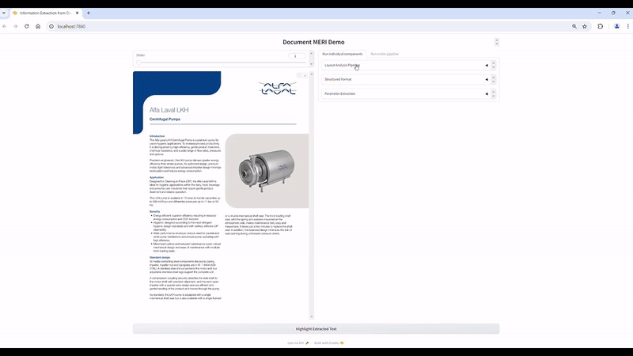

[](https://scorecard.dev/viewer/?uri=github.com/Novia-RDI-Seafaring/MERI)

 

Package for parameter extraction from pdf documents. Provided with a pdf file and json schema, MERI will return a populated dictionary following the provided json schema.

## Table of Contents
- [Installation](#installation)
  - [Requirements](#requirements)
  - [Installation](#installation)
  - [Installation from Source](#installation-from-source)
- [Docker](#docker)
    - [Development in docker](#development-in-docker)
    - [Run MERI demo in docker](#run-meri-demo-in-docker)
- [Usage](#usage)
- [Demo](#demo)
- [Method](#method)


# Installation

Requirements:
- python 3.12
- PyTorch ≥ 1.8 and torchvision that matches the PyTorch installation.
- create .env file in workspace and place open ai key there ```OPENAI_API_KEY='sk-...'```

Installation:
- ```pip install meri @ git+https://github.com/Novia-RDI-Seafaring/MERI/tree/main ```

Installation from source:
- ```git clone git@github.com:Novia-RDI-Seafaring/MERI.git¨```
- ```pip install .``` for edible mode ```pip install -e .```


# Docker

Easiest way to ensure correct setup is to run the project in a docker container. We provide two dockerfiles (```docker/```).

1. dev.Dockerfile installs all dependencies and can be used as a devcontainer in vscode [Development in docker](#development-in-docker)
2. app.Dockerfile installs all dependencies and runs the meri demo that is accessible via the browser on localhost:7860 [Run meri in docker](#run-meri-in-docker)

## Development in docker
1. Install the following extensions in VSCode:
    - Docker
    - Dev Containers

2. Press STRG + SHIFT + P and select "Dev Container: Open Folder in Container" (devcontainer.json exists in .devcontainer). This will build the docker container and connect the workspace to it.


## Run MERI demo in docker
To run MERI gradio demo in docker and forward the respective port:
1. build image: ```docker build -t meri_app -f /docker/app.Dockerfile .```
2. run container: ```docker run -it --gpus=all -p 7860:7860 --name meri_app_container meri_app```

Easiest way to ensure correct setup is to run the project in a docker container. We provide a dockerfile (```docker/Dockerfile```) for this purpose. 

# Usage

```python 
from meri import MERI, MERI_CONFIGS_PATH
import json
import os

pdf_path ='path/to/pdf.pdf'

# must be a valid json schema
schema_path ='path/to/schema.json'
with open(schema_path) as f:
    schema = json.load(f)

# use default configurartion
config_path=os.path.join(MERI_CONFIGS_PATH, "meri_default.yaml")

meri = MERI(pdf_path=pdf_path, config_yaml_path=config_path)

# populate provided json schema
populated_schema = meri.run(json.dumps(schema))

```


More examples how to use the package can be found in can be found in ```docs/notebooks```

### LLMs
package uses LiteLLM as a wrapper to interact with LLMs. In the meri configuration yaml file (e.g. meri_default.yaml) you can set the model name. For openai models just provide the model name as is. In order to interact with other providers, such as ollama, the model name must have the form ```<provider>/<model>``` e.g. ollama/llava:7b. The models must be multi-modal model, i.e. be able to process text as well as images.

# Demo
We provide a gradio demo in ```demo```. Run ```python demo/demo_meri_v1.py```. In ```data/demo_data``` we provide a example data sheet alongside a dummy json schema that specifies the parameters of interest. Upload both and run the extraction pipeline.



# Method


The proposed method requires two inputs: (1) the pdf document and (2) a json schema. Our method will initially detect layout elements such as tables, text and figures. Depending on the layout type different information extraction methods are applied to structurize the content and create an intermediate format (markdown). 
The intermediate format alongside the json schema are processed by an LLM to populate the extract the specified parameters. The output will follow the provided json schema.

## Acknowledgments

This work was done in the Business Finland funded project [Virtual Sea Trial](https://virtualseatrial.fi).

## License

This package is licensed under the MIT License license. See the [LICENSE](./LICENSE) file for more details.

## Citation

If you use this package in your research, please cite it using the following BibTeX entry:

```bibtex
@misc{MERI,
  author = {Christian Möller, Lamin Jatta},
  title = {MERI: Modality-Aware Extraction and Retrieval of Information},
  year = {2024},
  howpublished = {\url{https://github.com/Novia-RDI-Seafaring/MERI}},
}
